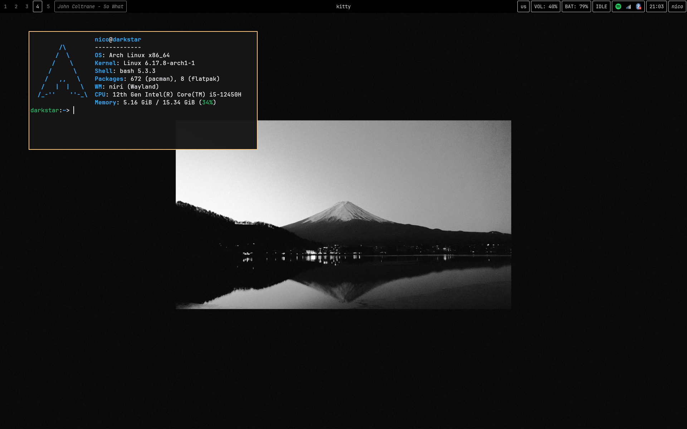



# Nirice

Hi, if you are reading this Markdown file it means you are at least interested in my rice.
I wanted to make something minimal, yet comfy and practical.

This is a sort of evolution of [Hyprrice](https://github.com/nickk19/hyprrice)

Here are the programs I use:
- **`Niri`** (as the window manager)
- **`Kitty`** (as the terminal)
- **`Waybar`** (as the bar)
- **`Wofi`** (as the launcher)
- **`Mako`** (as the notification daemon)
- **`Swayidle`** (as the idle manager)
- **`SWWW`** (to set the wallpaper)
- **`Swaylock`** (as the lock screen)
- **`Kanshi`** (to manage the displays) **NOTE**: The configuration file is based on the displays I use. You will have to edit it accordingly. 
- **`Wob`** (as the overlay)
- **`Cliphist`** (as the clipboard manager)
- **`Nautilus`** (as the file manager)
- **`Ly`** (as the display manager) **NOTE**: this config must be placed in `/etc/`

To manage Wi-Fi and Bluetooth connections, **`nm-applet`** and **`blueman-applet`** are used.

I use **`polkit-gnome`** as the authentication agent and **`xdg-desktop-portal-gnome`** as the desktop portal. 

The fonts I use:
- **`Noto Fonts`**
- **`Noto Fonts CJK`**
- **`Jebrains Mono Nerd Font`**
- [**`Apple Color Emojis`**](https://github.com/samuelngs/apple-emoji-linux)
